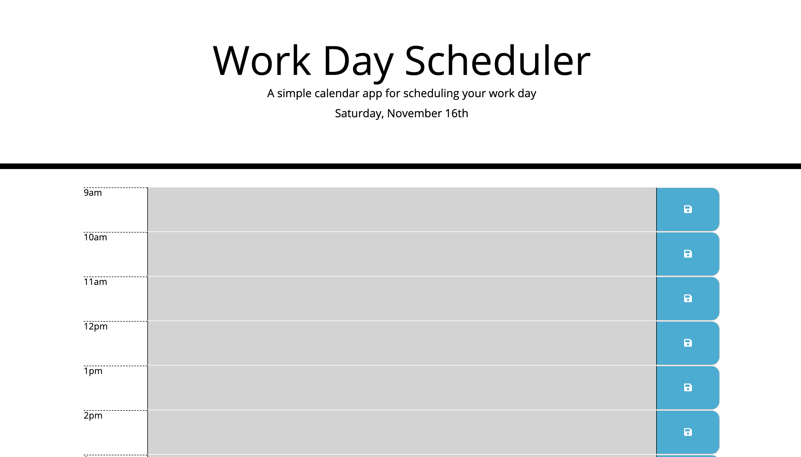

# Unit-05-Third-Party-APIs-Homework-Day-Planner

This HTML file was completed dynamically using Jquery and styled with CSS.
Keep track of your day easily by entering your day plans into the textareas click the save button and your text will be stored via local storage. If the time has past the block will be grayed out, present time is red and future time is green. 

view the deployed app here:

 https://tcauley91.github.io/Unit-05-Third-Party-APIs-Homework-Day-Planner/.